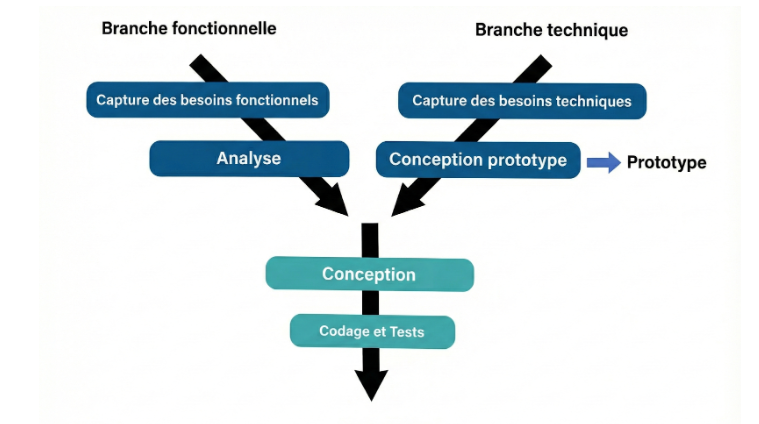
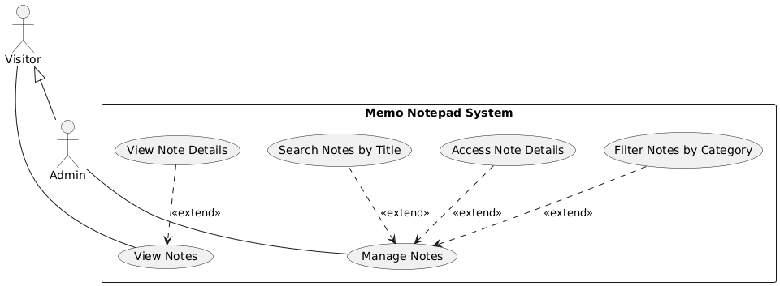
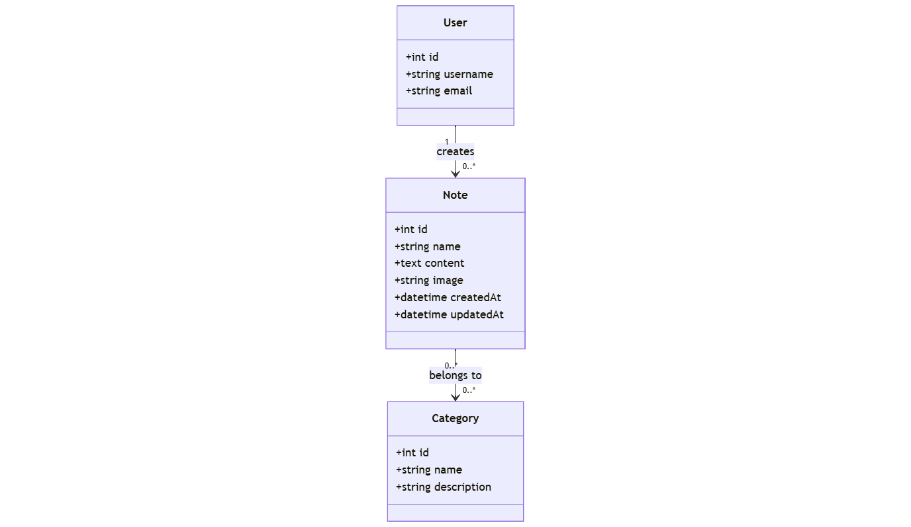

# **Présentation Projet-technique**
### Memo Notepad (Notes, Categories)  
**Réalisé par :** BENYEKHLEF Anouar  
**Encadré par :** M. ESSARRAJ Fouad

---

## La méthode Waterfall (En cascade)

---

## Travail à faire

### Développer l'Application Memo Notepad
*   **Partie Publique:** Interface permettant aux visiteurs de consulter les notes. Fonctionnalités : Recherche par titre, filtre par catégorie, pagination (10 éléments/page).
*   **Partie Admin:** Tableau de bord sécurisé pour les opérations CRUD. Fonctionnalités : Modales pour ajout/édition, AJAX pour les mises à jour asynchrones.

---

## Contexte

*   **Projet de Fin de Formation:** Travail sur le projet de fin de formation, commençant par la branche technique.

*   **Processus 2TUP:** Le projet suit la méthodologie 2TUP (Processus de développement en Y), séparant les branches Fonctionnelle, Technique et Réalisation.
  

*   **Solidification des Compétences:** Concentration sur le renforcement des compétences Laravel 12 sans outils d'IA, en s'appuyant sur l'expérience précédente à Solicode.

---

## Exigences: Analyse Technique

### Les technologies à utiliser

1.  **Base de données:** MySQL.
2.  **Framework:** Laravel 12.
3.  **Architecture N-Tiers:**
    - **Controller:** Requêtes HTTP.
    - **Service:** Logique métier.
    - **Model:** Base de données.
4.  **Architecture:** MVC.
5.  **Blade:** Templates réutilisables (components, layouts).
6.  **AJAX:** Interactions dynamiques (ex: Modales) sans rechargement de page.  

---

7.  **Téléchargement d'images:** Possibilité de télécharger et de joindre des images aux notes.
8.  **Support Multi-langue:** Support des langues française et anglaise (fr, en).
9.  **Vite:** Outil de build rapide.
10. **Preline UI:** Librairie UI.
11. **Lucide:** Librairie d'icônes.
12.  **Tailwind CSS:** Développement rapide, responsive.

---

## Analyse: Analyse Fonctionnelle

---

## Conception

---

## Sujet - Live coding
* Un bouton “Ajouter” qui ouvre une modale pour créer un nouvel élément.
* Une barre de recherche filtrant des éléments par titre.
